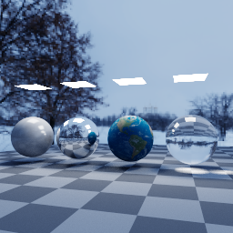
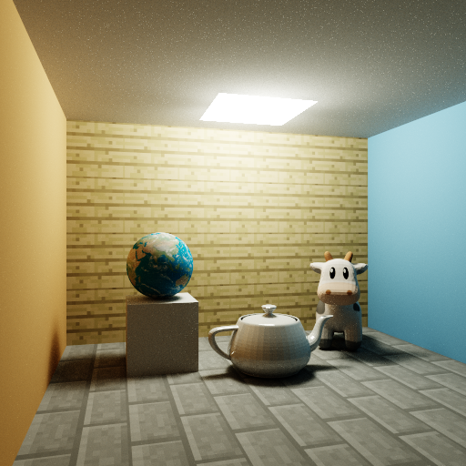
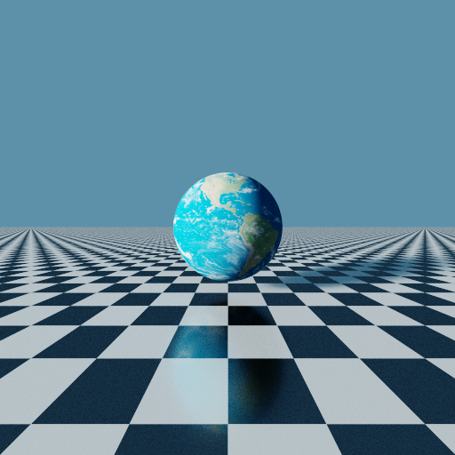
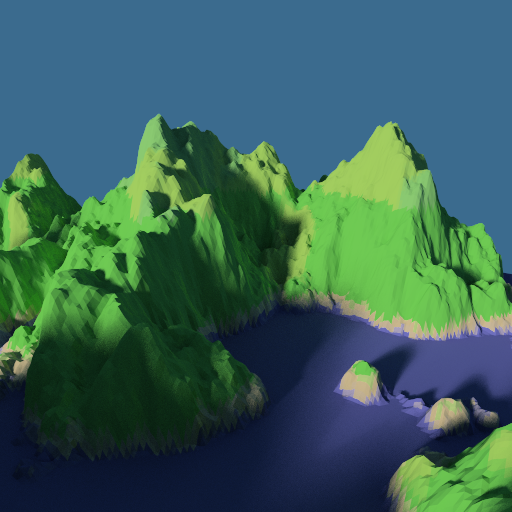

# JavaPathtracer
A pathtracer written in, of all things, Java

## Why?

I wanted to learn about photorealistic rendering without having to grapple with C++ or, worse, compute frameworks like OpenCL or CUDA. My choice of language makes the pathtracer slow as a dog, but nothing that can't be solved with some clever mathematical trickery and a lot of patience :)

## TODO List

* Switch to quasirandom sequences for sampling
* Normal mapping
* More model loaders
	* Contemplating an alternative solution: create a custom model format, move converters to an external project
* Some form of scene description

## Gallery

**Recent Tests**

**Older Renders**

## Dark Past

This project has two dead siblings:
* **[Pathtracer2](https://github.com/adrian154/Pathtracer2)**: my first pathtracer to achieve Monte Carlo pathtracing. It, too, is the result of an earlier and completely unsuccessful attempt. Read the source code at your own peril.
* **[java-pathtracer](https://github.com/adrian154/java-pathtracer)**: more successful but ultimately abandoned version of Pathtracer2. Probably failed because its name didn't adhere to Java naming convention :-)
