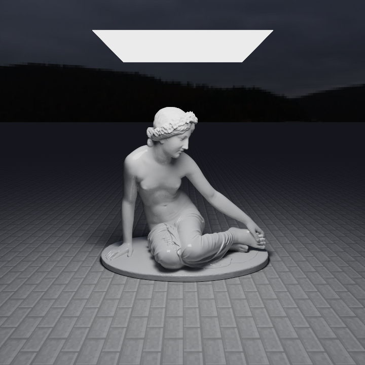
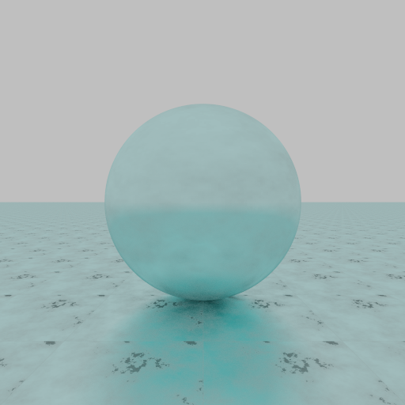
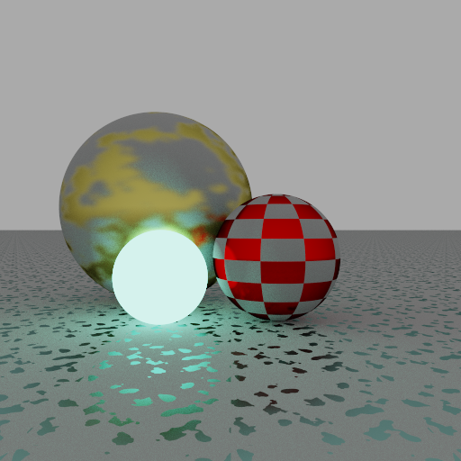
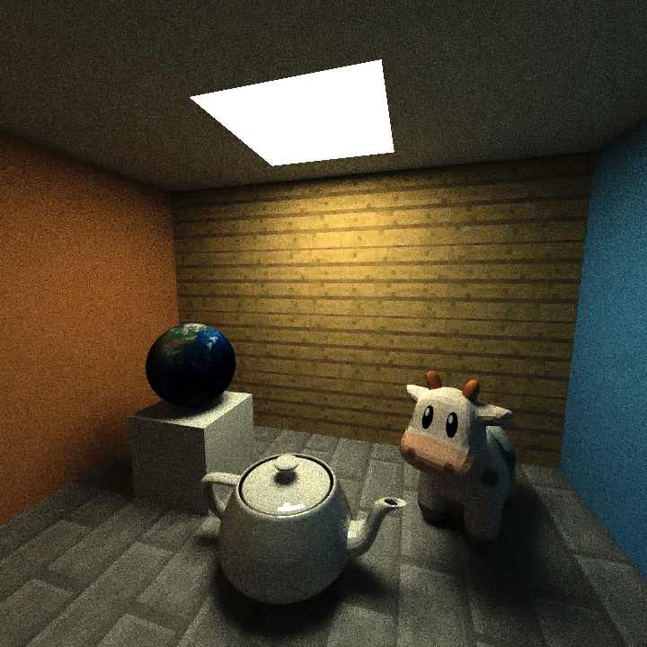

# JavaPathtracer
A pathtracer written in, of all things, Java

## Why?

I wanted to learn about photorealistic rendering without having to grapple with C++ or, worse, compute frameworks like OpenCL or CUDA. My choice of language makes the pathtracer slow as a dog, but nothing that can't be solved with some clever mathematical trickery and a lot of patience :)

## Features

* Unbiased Monte Carlo rendering
* Diffuse and specular materials
* Multithreaded rendering (your CPU will make noises you've never heard it make before...)
* OBJ support
* BVH to speed up mesh raytracing
* Live preview

**Upcoming:**

* Simple scripting language for scene description (I'll do it, I promise!)
* More model loaders, OR:
* Replace OBJ with my own format. Write converters and move those to an external project

## Gallery

**Recent Tests**

**Older Renders**

## Dark Past

This project has two dead siblings:
* **[Pathtracer2](https://github.com/adrian154/Pathtracer2)**: my first pathtracer to achieve Monte Carlo pathtracing. It, too, is the result of an earlier and completely unsuccessful attempt. Read the source code at your own peril.
* **[java-pathtracer](https://github.com/adrian154/java-pathtracer)**: more successful but ultimately abandoned version of Pathtracer2. Probably failed because its name didn't adhere to Java naming convention :-)
